#### 一、Markdown简介

`Markdown`是一种文本标记语言，它容易上手、易于学习，排版清晰明了、直观清晰。常用于撰写 **“技术文档”** 、 **“技术博客”** 、 **“开发文档”** 等等。 总之，如果你是一名开发者，并且你有写博客的欲望与想法时，使用`Markdown`是你不二的选择。

---

#### 二、Markdown语法

接下来，我们来看一下`Markdown`的  **“标准语法”**  。

我们看下大纲，其中包括：

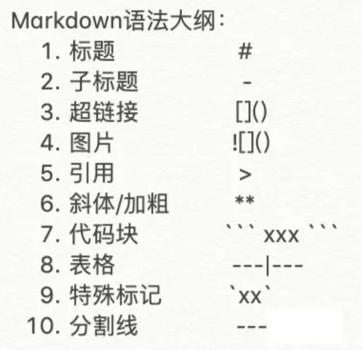

##### 1、标题

- 标准语法：使用`1~6`个`“#”`符 + “空格” + “你的标题”。

```shell
# 一级标题
## 二级标题
### 三级标题
#### 四级标题
##### 五级标题
###### 六级标题
```

- 效果图解：
  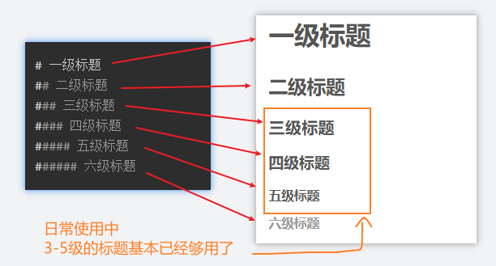

> 注：`#`和「标题」之间有一个空格，这是最标准的语法格式。 有些编辑器做了兼容，有的并没有。所以最好要加上空格。

##### 2、列表

- 标准语法：使用`-`符，在文本前加入`-`符即可。

```diff
- 文本1
- 文本2
- 文本3
```

如果你希望有序，在文本前加上`1. `、`2. `、`3. `、`4. `、`...`

> 注：`-`、`1. `、`2. `等和文本之间要保留一个字符的空格。

- 效果图解：

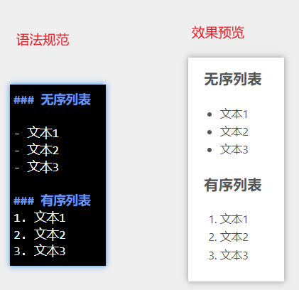

##### 3、超链接

- 标准语法：`[链接名](链接url)`
- 效果图解：

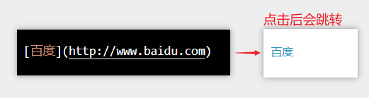

##### 4、图片

- 标准语法：

```scss

```

- 效果图解：

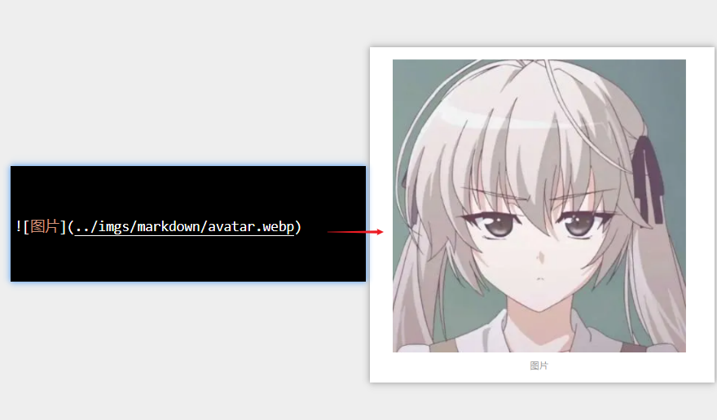

##### 5、引用

- 标准语法：`> 文本`
- 效果图解：

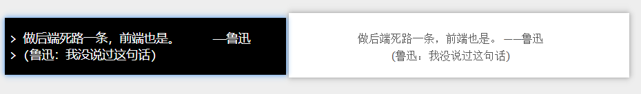

##### 6、斜体、加粗

- 标准语法 ***斜体***：`*文本*` ***加粗***：`**文本**` ***斜体&加粗***：`***文本***`
- 效果图解：

_斜体字_

**加粗字**

**_加粗/斜体字_**

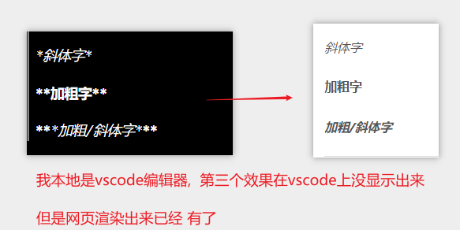

##### 7、代码块

- 标准语法： ` ``` 你的代码 ``` `（前面3个点，后面3个点）
- 效果图解：

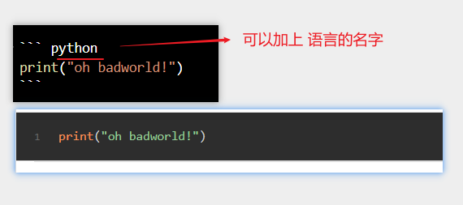

##### 8、表格

- 标准语法：

```bash
dog | bird | cat
----|------|----
foo | foo  | foo
bar | bar  | bar
baz | baz  | baz
```

- 效果图解：

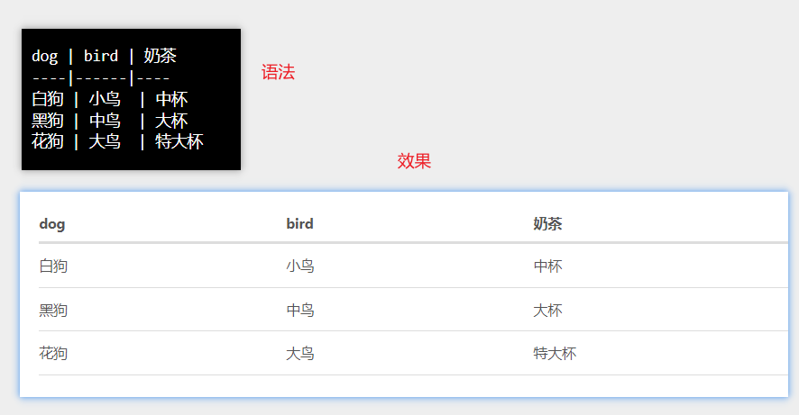

##### 9、特殊标记

- 标准语法：``

```go
`特殊样式`
```

- 效果图解：

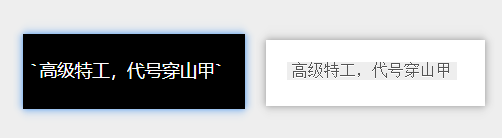

##### 10、分割线

- 标准语法：`---` 最少3个
- 效果图解：

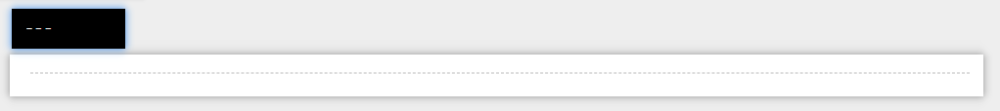

##### 11、常用html标记

注意：html标记只适合辅助使用，不一定所有编辑器都能生效。

- 标准语法：

换行符：`<br/>` （或者使用`Markdown`标准语法：空格+空格+回车，但我感觉不是很直观）  
上：`<sup>文本</sup>`  
下：`<sub>文本</sub>`

- 效果图解：

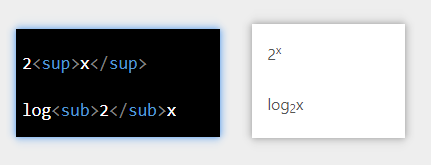

#### 12、内容折叠

把要折叠的内容写在 `<details>标签内`
把不要折叠的内容写在 `<summary>标签内`

```html
<details>
  <summary>more</summary>

  what's more? this is more.
</details>
```

- 效果图解：

<details>
<summary>点击我展开更多</summary>

what's more?
this is more.

</details>

#### 三、Markdown优点

- **纯文本**，所以兼容性极强，可以用**所有**文本编辑器打开。
- 让作者更专注于**写作**而不是排版。（大家都是技术人员嘛..）
- 格式转化方便，`markdown`文本可以很轻松转成`html`、`pdf`等等。（图个方便嘛）
- 语法简单
- **可读性强**，配合表格、引用、代码块等等，让读者瞬间“懂你”。

<hr/>

#### 参考文章：

[5分钟，带你迅速上手Markdown语法](https://juejin.cn/post/6844903927205330951)
