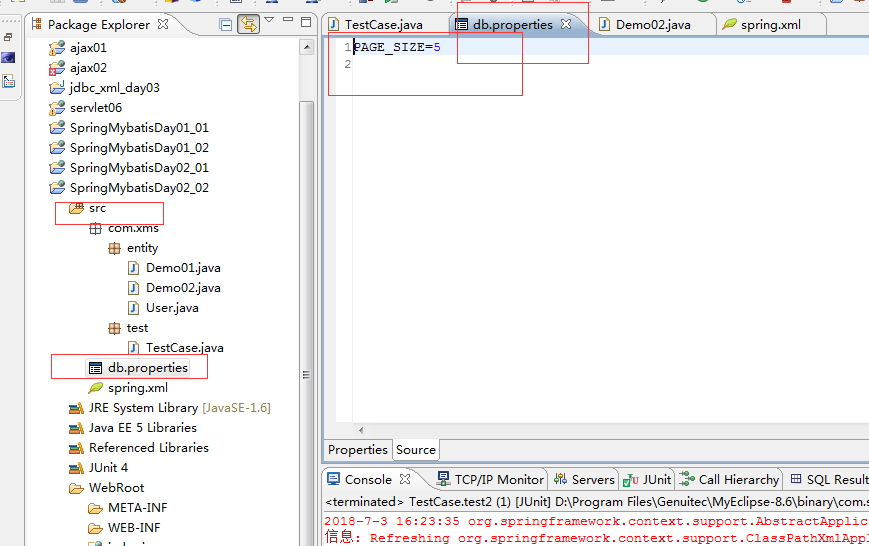

# SpringMyBatisDay02

> 全篇概述：IOC DI 参数值注入 注解依赖注入

## 1.Spring IOC

IOC 全称Inversion Of Control，被翻译成控制反转

控制反转指：程序中对象的获取方式发生反转，由最初的通过new关键字方式创建对象，转变为由第三方框架创建，注入（DI），它能降低对象之间的耦合度

第一方：JDK
第二方：开发者
第三方：引入其他人写出的jar包

Spring容器在创建中，采用DI(依赖注入)方式实现IOC控制，IOC是Spring框架的基础和核心

DI全称：Dependency injection,被翻译成依赖注入，
依赖注入的基本原理是将一起工作具有关联关系的对象通过方法参数传入，建立关系，容器的工作就是创建Bean对象时，注入依赖关系

IOC是一种思想，而DI是实现IOC的主要技术途径

DI主要有两种注入方法，即Setter注入和构造器注入

```xml
    <!-- Setter注入 属性property，值value -->
    <bean id="emp" class="com.xms.entity.Emp">
        <property name="id">
            <value>404</value>
        </property>
        <property name="name" value="煲仔兽"></property>
    </bean>
```

```xml
<!-- 构造器注入 -->
    <bean id="dept" class="com.xms.entity.Dept">
        <constructor-arg index="0">
            <value>500</value>
        </constructor-arg>
        <constructor-arg index="1" value="调bug部"></constructor-arg>
    </bean>
```

```xml
    <!-- 构造器注入 -->
    <bean id="dept" class="com.xms.entity.Dept">
        <!-- value标签或者属性的值默认时String类型 -->
        <!-- type属性时指定参数的类型 -->
        <constructor-arg name="id" type="java.lang.Integer">
            <value>500</value>
        </constructor-arg>
        <constructor-arg name="name" value="调bug部"></constructor-arg>
    </bean>
```

自动装配
Spring容器可以自动去装配（autowire）相互协作Bean之间的关联关系，autowire可以针对单个Bean进行设置，方便之处在于减少XML注入的配置

在配置文件中，可以在<bean>标签中使用autowire属性指定自动装配规则，一共有三种类型值
byName：根据属性名自动装配，此选项将检查容器，根据名字来查找与属性名一致的Bean，将其与属性自动装配（Setter注入）
byType：如果容器中存在一个与指定属性类型相同的Bean，则将与此属性自动装配（Setter注入）
constructor：与byName方式类似，不同之处在于它应用于构造器方式(构造器注入)

三种类型值：视情况而定，选择最合适的

## 2.参数值注入

1）注入基本值
<value>标签可以通过字符串指定属性或构造器参数的值，容器将字符串从默认类型(java.lang.String)
转换成实际的属性或构造器参数类型，然后给Bean对象注入

2）注入Bean对象
注入外部Bean对象(引用方法，方便重用)
ref属性，引入对象的id, 看下方的代码区

3）注入集合
通过<list>,<set>,<map>,<props>标签来定义与Java中对应的List，Set，Map及Properties的属性值
Map和Properties用keyset()方法，返回键值的集合，返回的类型是Set

```xml
    <bean class="com.xms.entity.User" id="user">
        <property name="id">
            <value>201</value>
        </property>
        <property name="name" value="张无极"></property>

    </bean>


    <bean class="com.xms.entity.Demo01" id="demo01">
        <!-- 基本值的注入 -->
        <property name="id">
            <value>110</value>
        </property>
        <property name="name" value="张丹峰"></property>

<!-- Bean对象 -->
        <property name="user" ref="user">
        </property>
<!-- List -->
        <property name="languages">
            <list>
                <value>Java</value>
                <value>javascript</value>
                <value>Python</value>
            </list>
        </property>
<!-- Set -->
        <property name="cities">
            <set>
                <value>苏州</value>
                <value>杭州</value>
                <value>成都</value>
            </set>
        </property>

<!-- map -->
        <property name="scores">
            <map>
                <entry key="jsd1081">
                <value>78</value>
                </entry>
                <entry key="jsd1805">
                <value>86</value>
                </entry>
                <entry key="jsd1806" value="99">
                </entry>
            </map>
        </property>

<!-- Properties -->
        <property name="properties">
            <props>
                <prop key="user">root</prop>
                <prop key="password">1234</prop>
            </props>
        </property>

    </bean>
```

4）注入Spring表达式
　　Spring表达式语言，和EL表达式在语法上很相似，可以读取一个Bean对象，或者是集合中的数据

```xml
    <bean class="com.xms.entity.User" id="user">
        <property name="id">
            <value>201</value>
        </property>
        <property name="name" value="张无极"></property>

    </bean>


    <bean class="com.xms.entity.Demo01" id="demo01">
        <!-- 基本值的注入 -->
        <property name="id">
            <value>110</value>
        </property>
        <property name="name" value="张丹峰"></property>

<!-- Bean对象 -->
        <property name="user" ref="user">
        </property>
<!-- List -->
        <property name="languages">
            <list>
                <value>Java</value>
                <value>javascript</value>
                <value>Python</value>
            </list>
        </property>
<!-- Set -->
        <property name="cities">
            <set>
                <value>苏州</value>
                <value>杭州</value>
                <value>成都</value>
            </set>
        </property>

<!-- map -->
        <property name="scores">
            <map>
                <entry key="jsd1081">
                <value>78</value>
                </entry>
                <entry key="jsd1805">
                <value>86</value>
                </entry>
                <entry key="jsd1806" value="99">
                </entry>
            </map>
        </property>

<!-- Properties -->
        <property name="properties">
            <props>
                <prop key="user">root</prop>
                <prop key="password">1234</prop>
            </props>
        </property>

    </bean>

<!-- 采用引用的标签注入集合 -->
<!-- 声明集合 -->
        <util:list id="list">
                <value>Java</value>
                <value>javascript</value>
                <value>Python</value>
        </util:list>

        <util:set id="set">
                <value>苏州</value>
                <value>杭州</value>
                <value>成都</value>
        </util:set>

        <util:map id="map">
            <entry key="jsd1081">
                <value>78</value>
                </entry>
                <entry key="jsd1805">
                <value>86</value>
                </entry>
                <entry key="jsd1806" value="99">
                </entry>
        </util:map>

        <util:properties id="properties">
                <prop key="user">root</prop>
                <prop key="password">1234</prop>
        </util:properties>

        <bean class="com.xms.entity.Demo01" id="demo011">
            <!-- 集合 -->
            <property name="languages" ref="list"></property>
            <property name="cities" ref="set"></property>
            <property name="scores" ref="map"></property>
            <property name="properties" ref="properties"></property>
        </bean>

    <!-- 加载属性配置文件,框架把properties文件加载成一个Properties集合 -->
        <util:properties id="db" location="classpath:db.properties"></util:properties>

    <bean class="com.xms.entity.Demo02" id="demo02">
        <property name="name" value="#{user.name}"></property>
        <property name="language" value="#{demo01.languages[1]}"></property>
        <property name="city" value="#{set[0]}"></property>
        <property name="score" value="#{map.jsd1805}"></property>
        <property name="pageSize" value="#{db.PAGE_SIZE}"></property>
    </bean>
```



5）注入NULL或空字符串 了解
Spring将属性的空参数当做空String

```xml
<bean>
        <property name="name" value="" />
</bean>
```

如果需要注入NULL，可以使用NULL标签

```xml
<bean>
　　<property name="name">
　　　　<null/>
　　</property>
</bean>
```

## 3.基于注解依赖注入

具有依赖关系的Bean对象，可以使用以下任意一种注解实现注入
@Autowired/@Qualifer 组合
可以处理构造器注入和Setter注入
@Autowired写在构造器或set方法前，声明需要为其注入Bean对象
@Qualifer写在参数前面，声明注入Bean的id

@Resource
