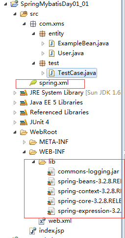

# SpringMyBatisDay01

## 1.Spring简介

Spring是一个开源轻量级应用开发框架，其目的是用于简化企业级应用程序的开发，降低侵入性
Spring提供IOC和AOP功能，可以将组件(就是类)之间的耦合度降至最低，解耦，便于系统的升级和维护
Spring的本质是管理软件中的对象，即创建对象和维护对象之间的关系.

## 2.Spring容器

在Spring中，任何组件都可以当成Bean处理，通过容器管理

Spring容器BeanFactory和ApplicationContext两种类型

Spring容器的实例化
ApplicationContext继承自BeanFactory接口，拥有更多的企业级开发方法(推荐)

```bash
# 加载工程classpath下的配置文件实例化
String xml="配置文件路径";//物理路径(电脑硬盘上的文件)
ApplicationContext ac= new ClassPathXmlApplicationContext(xml);
```

Spring容器的使用
1.)首先在容器的配置文件Spring.xml中添加Bean组件定义
<bean id="标识符" class="Bean组件类型" ></bean>
2.)然后再创建容器对象后，调用getBean方法获取Bean组件实例
getBean("标识符");

注意：Spring容器默认调用无参构造器来实例化
Caseby:出现异常，就看上面的Caseby消息

## 3.Bean的作用域(使用范围)

Spring容器在实例化Bean时，可以创建以下作用域的Bean对象

```bash
scope属性：
1.singleton：在Spring容器中一个Bean定义对应一个实例对象，默认项
2.prototype：一个Bean定义对应多个实例对象
3.request：在一次Http请求中，一个Bean定义对应一个实例对象
4.session：在一次Http Session中，一个Bean定义对应一个实例对象
```

Bean的作用域可以通过<bean>定义的scope属性指定

## 4.Bean的生命周期

指定初始化回调方法
<bean init-method="" /> "内容"引号里面填的内容是Bean类中自定义的方法名

指定销毁回调方法,仅适用于单例模式
<bean destroy-method=""/>

在<beans>标签中通过default-init-method属性，可以为容器中的<bean>指定初始化回调方法， 了解 --全局指定
也可以通过default-destroy-method属性为容器中的<bean>指定销毁回调方法

## 5.Bean的延迟实例化 （默认非延迟，目的：用空间换时间。比如：用户打开一个网页，这个网页隔了5秒才打开，用户可能在没打开之前就关了页面，所以为了缩短时间，占用空间）

默认行为是在容器实例化的同时将单例模式的Bean提前进行实例化

延迟实例化操作o:在<bean>声明时指定其属性lazy-init为true，一个延迟实例化的Bean将在第一次被用到时才实例化
注意：仅适用于单例模式

在<beans>标签中通过default-lazy-int属性，可以为容器中的<bean>指定延迟实例化的特性 ---全局指定 了解



## 6.基于注解的组件扫描

什么是组件扫描？
指定一个包路径，Spring会自动的扫描此包及其子包中的组件类，当发现组件类定义前如果有特定的注解标记时，就将此组件类纳入到Spring容器中管理，
等价于原有的XML配置中的<bean>定义

组件扫描方式可以替代大量的XML配置的<bean>定义
指定扫描类路径，使用组件扫描，首先需要在XML配置文件中指定扫描父级package路径

```xml
    <!-- 指定扫描包，开启注解扫描 -->
    <context:component-scan base-package="com.xms"></context:component-scan>
```

容器会自动的扫描指定包及其子包下的所有组件类，如果此组件类定义前有特定的注解标记，则会将此组件类实例化为Bean对象

```bash
自动扫描的注解标记
@Component 通用注解
@Repository 持久层组件注解 DAO（数据存储或者读写）
@Service 业务层组件注解
@Controller 控制层组件注解
```

自动扫描组件的命令
当一个组件在扫描过程中，被检测到时，会生成一个默认的id值，默认的id值为小写开头的组件名，也可以在注解标记中自定义id值

```java
@Component("admn")

ApplicationContext as=new ClassPathXmlApplicationContext("spring.xml");
User user=(User)as.getBean("admn");
```

指定组件的作用域(以注解的方式)
@Scope注解可以指定作用域，只需要在注解中提供作用域的名称即可

指定初始化和销毁回调方法
@PostConstruct和@PreDestroy注解分别用于指定初始化和销毁回调方法

注意：在注解操作中，取消了延迟实例化操作
