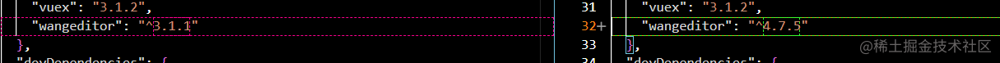
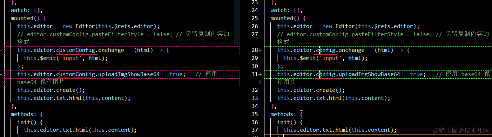
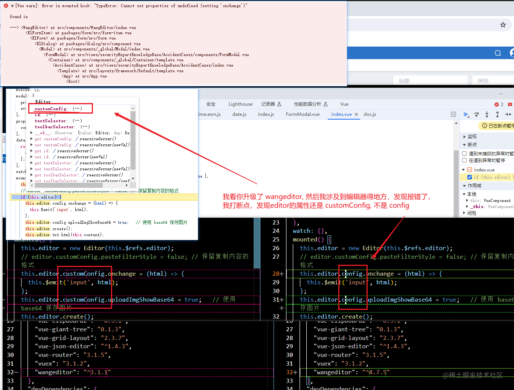
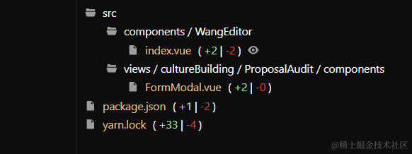

## 前言

起因：同事升级了项目中用到的某个第三方包。

项目中用到了 `wangEditor` , 因同事负责的模块，涉及到这个编辑器，他对这个编辑器包进行了升级，从我们原本的 `3.1.1`版本，升级到了 `4.7.5`版本。



然后，编辑器内部，也涉及到了调整



## 过程记录

我呢，一开始，没有去看他提交的代码的具体内容，就直接拉取代码，更新，然后 `yarn serve `，把代码跑起来了。

因为我这里的模块也涉及到了 `wangEditor` , 发现报错了，我回头看日志，发现是他升级了 `wangEditor` ，也对编辑器那边的代码做了修改，就是【this.editor.customConfig】改成了【this.editor.config】



第一反应是，这小子不会是改错了什么东西吧，不然为什么我本地依旧是【customConfig】，然后想到，他升级了包，我只是拉取了最新代码，但是没有更新包，所以，应该是我本地，用到的依旧是 `旧的wangEditor包`



## 解决方法

### 1. 直接`yarn`，根据package.json 和 yarn.lock 文件 安装新的依赖

在`终端`执行 `yarn` 重新安装依赖，然后再执行`yarn serve`，发现问题解决，编辑器能正常打开，控制台也不报错。

### 2.1.1. 先移除本地的wangeditor包的依赖，再install 新版本包的wangeditor

但是，有时候，直接 `yarn`也有犯抽的时候，你`yarn`之后，发现用的依赖还说老的依赖，这个时候，你可以直接把 整个 `node_modules`文件夹，全部删掉，重新 `yarn install`一下。

如果，你不想把 `node_modules`文件夹 全删掉，重新再安装，因为这样删除，挺费时间的，那么也可以，找到升级的那个 `"wangeditor": "^4.7.5"`包，先本地移除这个包，`yarn remove wangeditor`
，让`yarn`命令 把本地的这个旧的包的依赖给在卸载掉。然后 执行`yarn add wangeditor@4.7.5` 用`yarn`直接下载最新的包。

### 2.1.2 使用 yarn upgrade命令

```bash
yarn upgrade [package]@[version]

以 wangeditor为例，我要给我本地安装 4.7.5的依赖，那么
yarn upgrade wangeditor@4.7.5
```

### 2.2. （终极解决方法）删除所有依赖，重新安装依赖

这个在 `2.1.1`里面已经提到过了，就是把 【整个 `node_modules`文件夹】，全部删掉，重新 `yarn install`一下。`（这个办法应该是终极办法）`
