## 背景

`Jest` 是一个 `JavaScript` 集大成的测试库，是我们`单元测试的基础`；而 `React Testing Library` 则提供了一些 `React Component` 的 `Api` ，来协助我们进行 `React Dom` 和`事件相关的单测编写`。

本文主要介绍下 jest的常见断言

## 按类型划分

| 场景方向       | 断言Api                                                                                                                       |
| -------------- | ----------------------------------------------------------------------------------------------------------------------------- |
| 基础类型的比较 | `not` `toBe(value)` `toBeTruthy(value)` `toBeFalsy(value)` `toBeDefined()` `toBeUndefined()` `toBeCloseTo(value)` `toBeNaN()` |
| 引用类型的比较 | `toEqual(value)`                                                                                                              |
| 数字符号       | `toBeGreaterThan(value)` `toBeLessThan(value)` `toBeGreaterThanOrEqual(value)` `toBeLessThanOrEqual(value)`                   |
| 正则匹配       | `toMatch(value)` `toMatchObject(value)`                                                                                       |
| 表单验证       | `toContain(value)` `arrayContaining(value)` `toContainEqual(value)` `toHaveLength(value)` `toHaveProperty(value)`             |
| 错误抛出       | `toThrow()` `toThrowError()`                                                                                                  |

### 基础类型

ps: 前置知识：

- `test` 用于定义`单个`的用例，与此类似的还有 `describe` 和 `it`
- `describe` 表示`一组`用例，其中可以包含多组 `test`
- `it` 是 `test` 的别名，有相同的作用

JavaScript 中分为基础类型和引用类型，其中基础类型中，大部分比较都可以通过 `toBe` 来完成，而`not`则用来表示非的判断，比如下面的简单例子。

```js
// ./src/__test__/expect.test.ts
import React from "react";

describe("jest 断言", () => {
  test("基础类型的比较", () => {
    // tobe
    expect(1 + 1).toBe(2);
    // not
    expect(1 + 1).not.toBe(3);
    // ...
  });
});
```

不仅是数字，包括 boolean 和 undefined 在内都是可以的。

```js
// ./src/__test__/expect.test.ts
test("基础类型的比较", () => {
    // ...
    // boolean
    expect(true).toBe(true);
    // undefined
    expect(undefined).toBe(undefined);
});
...
```

虽然这些可以通过 toBe 判断，但是同时 Jest 还提供了 4 个 API 来判断 true、 false、undefined、defined，效果与 toBe 来判断是都相同的。

```js
// ./src/__test__/expect.test.ts
test("基础类型的比较", () => {
    // ...
    // boolean
    expect(true).toBe(true);
    expect(true).toBeTruthy();
    expect(false).toBeFalsy(); // undefined
    expect(undefined).toBe(undefined);
    expect(undefined).not.toBeDefined();
    expect(undefined).toBeUndefined();
});
...
```

不仅是针对变量，对函数返回值的判断也是可以的，比如：

```js
// ./src/__test__/expect.test.ts
test("基础类型的比较", () => {
    // ...
    // undefined
    const test = () => {
      console.log(test);
    };
    expect(test()).toBeUndefined();
});
...

```

虽然 toBe 的能力很强大，但是针对浮点类型就不行了，比如：

```js
// ./src/__test__/expect.test.ts
test("基础类型的比较", () => {
  // ...
  // 浮点数
  expect(0.2 + 0.1).toBe(0.3);
});
```

针对这个用例，我们会得到下面的结果。

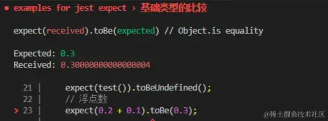

这个倒不是 Jest 的原因，而是由于 JavaScript 本身的特性导致的，我们知道 JavaScript 中数字只有一个 number 类型，与 Java 等语言不同，JavaScript 并没有类似 float 或是 double 的浮点类型，浮点的实现都采用 double(双精度存储）。

大学时候计组课程我们学过，针对双精度存储，包含 8 个字节，也就是 64 位二进制（1 位符号位，11 位阶码（指数位），52 位尾数位），而十进制转二进制可能是除不尽的，52 位尾数位后面的位数就会被抹掉。

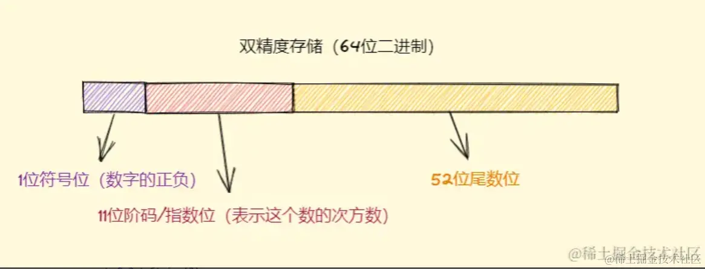

所以针对 0.1 + 0.2 的计算其实是这样的过程，首先需要把 0.1 和 0.2 转化成对应的二进制。

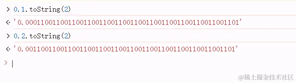

这样加起来得到的结果就是 0.0100110011001100110011001100110011001100110011001101，因为上面我们说过 JavaScript 是会把 52位尾数后的内容抹掉的，所以这个结果并不是完全精准的，转换为十进制就是 0.30000000000000004，所以没办法全等。

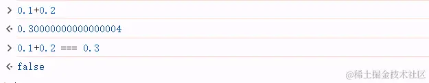

所以针对浮点数的比较，Jest 有提供一个专门的断言来进行判断，那就是 toBeCloseTo，和它的字面意思相同，这个断言用来判断对象和预期的精度是否足够接近，而不再是全等，例如下面的例子：

```js
// ./src/__test__/expect.test.ts
test("基础类型的比较", () => {
    // ...
    // 浮点数
    expect(0.2 + 0.1).toBe(0.3);
    expect(0.2 + 0.1).toBeCloseTo(0.3);
});
...
```

这样看下来，toBe 是不是和我们平时常用的 === 很像，不过严格意义上说，toBe 的效果并不等同于 全等===， **它是一种更加精确的匹配，应该说等同于 Object.is**，这个是 ES6 提供的新方法，相比 ===， 它修复了 JavaScript 历史的两个问题，NaN 和 +(-)0 。

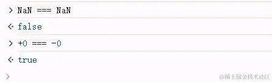

对于 Object.is 这两个不合理的判断都得到了修复。

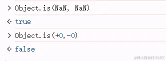

针对这两个场景，我们可以写如下的断言，其中`toBeNaN` 也是 Jest 提供的额外基础断言 API，效果上与`toBe(NaN)` 也是相同的。

```js
// ./src/__test__/expect.test.ts
test("基础类型的比较", () => {
    // ...
    // NaN
    expect(NaN).toBe(NaN);
    expect(NaN).toBeNaN();
    // +0 -0
    expect(+0).not.toBe(-0);
});
...
```

### 引用类型的比较

除了基础类型外，我们知道 JavaScript 还有引用类型，与基础类型不同的是，引用类型的全等，是对引用类型的内存指针进行比较，对于深拷贝或是属性完全相同的对象，使用 toBe 的断言是不能满足预期的，所以 Jest 有专门为这类情况提供断言 toEqual(value)，相比 toBe，toEqual 会深度递归对象的每个属性，进行深度比较，只要原始值相同，那就可以通过断言。我们来看下面的例子。

```js
// ./src/__test__/expect.test.ts
test("引用类型的比较", () => {
    const a = { obj1: { name: "obj1", obj2: { name: "obj2" } } };
    const b = Object.assign(a);
    const c = JSON.parse(JSON.stringify(a));
    expect(a).toBe(b);
    expect(a).not.toBe(c);
    expect(a).toEqual(b);
    expect(a).toEqual(c);
});
...
```

其中有 a, b, c 三个对象，b 对象是基于 a 对象的浅拷贝，而 c 对象是基于 a 对象的深拷贝，我们可以看到，a 和 b 是可以通过 toBe 来验证的，因为它们指向同一个内存指针，而 c 是完全开创出来的独立的内存空间，所以不能用全等进行验证，这里我们采用 toEqual 进行验证。

值得一提的是，toEqual 能不能用于验证基础类型呢？也是可以的，我们看下面的例子。

```js
// ./src/__test__/expect.test.ts
test("引用类型的比较", () => {
    // ...
    expect(1 + 1).toEqual(2);
});
...
```

我们上面有提到，toEqual 是采用深度递归的方式进行的原始值比较，虽然基础类型本身并不是对象，但是在对它们的 proto 进行递归比较的时候，会调用它们对应的包装类型创建实例，实例本身是可以作为对象进行比较的，所以 toEqual 同样可以用于基础类型的比较，比较的结果预期将是所有递归属性的值相等。

### 数字符号

我们在书写单测验证一些场景的时候，经常会有数字值比较的需求，比如 > ， < 等，这些也有对应的基础断言可以进行验证，比较简单就不过多讲解了，大家可以看看下面的例子。

```js
// ./src/__test__/expect.test.ts
test("数字符号", () => {
    // >
    expect(3).toBeGreaterThan(2);
    // <
    expect(3).toBeLessThan(4);
    // >=
    expect(3).toBeGreaterThanOrEqual(3);
    expect(3).toBeGreaterThanOrEqual(2);
    // <=
    expect(3).toBeLessThanOrEqual(3);
    expect(3).toBeLessThanOrEqual(4);
  });
...
```

### 正则匹配

正则匹配同样也是我们开发中比较常见的场景，针对这个场景，Jest 断言中有两个常用的匹配器会经常使用，分别是 `toMatch(regexp)` 和 `toMatchObj(value)`，其中 `toMatch(regexp)` 会匹配字符串是否能够满足正则的验证，而`toMatchObj(value)`则用来验证对象能否包含 value 的全部属性，即 value 是否是匹配对象的子集，我们来看下面的例子。

```js
// ./src/__test__/expect.test.ts
test("正则匹配", () => {
    expect("This is a regexp validation").toMatch(/regexp/);
    const obj = { prop1: "test", prop2: "regexp validation" };
    const childObj = { prop1: "test" };
    expect(obj).toMatchObject(childObj);
  });
...
```

### 表单验证

我们在需求中经常会有很多表单，对于表单值的判断也是一个很常遇到的场景，表单验证中我们经常会有值为数组或是对象的判定，所以验证某个字段是否在对象或者数组中是很有必要的。表单验证中也有提供对应能力的断言：

- `toContain(value)` ：判定某个值是否存在在数组中。
- `arrayContaining(value)`：匹配接收到的数组，与 toEqual 结合使用可以用于判定某个数组是否是另一个数组的子集。
- `toContainEqual(value)` ：用于判定某个对象元素是否在数组中。
- `toHaveLength(value)`：断言数组的长度 。
- `toHaveProperty(value)`：断言对象中是否包含某个属性，针对多层级的对象可以通过 xx.yy 的方式进行传参断言。

我们来结合下面的例子具体说明：

```js
// ./src/__test__/expect.test.ts
test("表单验证", () => {
    // 数组元素验证
    expect([1, 2, 3]).toContain(1);
    expect([1, 2, 3]).toEqual(expect.arrayContaining([1, 2]));
    expect([{ a: 1, b: 2 }]).toContainEqual({ a: 1, b: 2 });
    // 数组长度
    expect([1, 2, 3]).toHaveLength(3);
    // 对象属性验证
    const testObj = {
      prop1: 1,
      prop2: {
        child1: 2,
        child2: "test",
      },
    };
    expect(testObj).toHaveProperty("prop1");
    expect(testObj).toHaveProperty("prop2.child1");
  });
...
```

在上面的例子中，我们分别对基础元素、数组子集、对象子集的包含关系、数组长度、对象包含的属性进行了断言，对于复合属性断言的场景，我们可以采用类似 `expect(testObj).toHaveProperty("prop2.child1")`的方式进行传参，用 . 来体现对应的层级关系即可。

值得一提的是，`expect([1, 2, 3]).toEqual(expect.arrayContaining([1, 2]));`与之前的断言不同，我们使用`expect.arrayContaining([1, 2])`来替代了文字值，也就是能匹配所有能够涵括它的数组。只要 [1, 2] 是数组 A 的子集，那么数组 A 就可以成为 `arrayContaining` 的匹配对象。

### 错误抛出

最后一个要介绍的场景就是错误抛出，无论是业务或是基础组件代码，错误抛出都是一个常见的场景，对于这些异常情况的断言，也是我们单元测试的一个重要部分。针对这种场景，Jest 提供了 `toThrow` 和 `toThrowError` 两个匹配器，这两个匹配器能力都相同，`toThrowError` 可以理解成是 `toThrow` 的一个别名，我们来看下面的例子。

```js
// ./src/__test__/expect.test.ts
test("错误抛出", () => {
    const throwError = () => {
      const err = new Error("console err: this is a test error!");
      throw err;
    };
    expect(throwError).toThrow();
    expect(throwError).toThrowError();

    const catchError = () => {
      try {
        const err = new Error("console err: this is a test error!");
        throw err;
      } catch (err) {
        console.log(err);
      }
    };
    expect(catchError).not.toThrow();
    expect(catchError).not.toThrowError();
  });
...
```

对于上面的例子，值得一提的是`expect(throwError).toThrow();`中，throwError方法只需要传入即可，不需要执行，即`expect(throwError).toThrow();`，直接执行会抛出未捕获的错误，中断后续的测试进程。

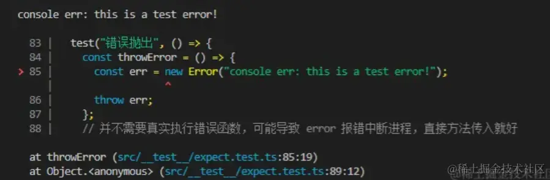

## 自定义断言

上文我们已经针对常见的断言场景，介绍了 Jest 提供的一些常用的匹配器 API，当然官方还提供了一些别的匹配器，不过在日常需求中并不常用，感兴趣的同步可以移步[官网](https://link.juejin.cn/?target=https%3A%2F%2Fjestjs.io%2Fdocs%2Fexpect%23expectarraycontainingarray "https://jestjs.io/docs/expect#expectarraycontainingarray")了解更多。

除了基础的已经定义好的断言 API，Jest 也支持我们自定义断言匹配器，来覆盖基础的断言不能覆盖到的特殊业务场景，我们可以使用 Expect.extend 来自定义断言，我们先通过这个 API 的类型，来对它的能力有个初步的了解。

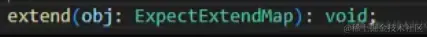

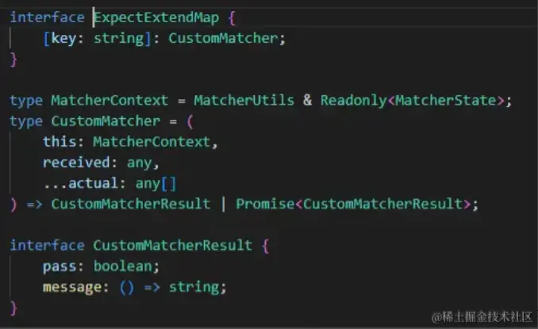

可以看到 `extend` 可以接收一个 key - matcher 的映射 map，不难猜到，key 是自定义匹配器的名称，而 CustomMatcher 则对应匹配器的定义。通过 CustomMatcher 的类型定义我们可以看到，自定义匹配器包含同步（CustomeMatcherResult) 和 异步（Promise)两种，它们都接收类型为 `{ pass: boolean; message: () => string } `的返回值，其中 pass 表示这个断言是否通过，而 message 则作为这个结果的备注信息。

我们首先来尝试定义一个同步的匹配器，想象一个场景，假如我们需要断言一个数字是否在 0 到 10 之间，应该怎么实现这个匹配器呢？我们来看下面的例子。

```js
// ./src/__test__/expect.test.ts
test("同步自定义匹配器", () => {
    const toBeBetweenZeroAndTen = (num: number) => {
      if (num >= 0 && num <= 10) {
        return {
          message: () => "",
          pass: true,
        };
      } else {
        return {
          message: () => "expected num to be a number between zero and ten",
          pass: false,
        };
      }
    };
    expect.extend({
      toBeBetweenZeroAndTen,
    });
    expect(8).toBeBetweenZeroAndTen();
    expect(11).not.toBeBetweenZeroAndTen();
  });
...
```

可以看到同步匹配器的实现很简单，我们只需要在我们预期的判断逻辑中返回对应的结构体，然后将对应的匹配器方法传给 extend 后，就可以通过 expect 来调用对应的匹配器了。现在我们来改造一下这个匹配器，使得它可以支持异步的场景。

```js
// ./src/__test__/expect.test.ts
test("异步自定义匹配器", async () => {
    const toBeBetweenZeroAndTen = async (num: number) => {
      const res = await new Promise<{ message: () => string; pass: boolean }>(
        (resolve) => {
          setTimeout(() => {
            if (num >= 0 && num <= 10) {
              resolve({
                message: () => "",
                pass: true,
              });
            } else {
              resolve({
                message: () =>
                  "expected num to be a number between zero and ten",
                pass: false,
              });
            }
          }, 1000);
        }
      );
      return (
        res || {
          message: () => "expected num to be a number between zero and ten",
          pass: false,
        }
      );
    };
    expect.extend({
      toBeBetweenZeroAndTen,
    });
    await expect(8).toBeBetweenZeroAndTen();
    await expect(11).not.toBeBetweenZeroAndTen();
  });
...
```

## 怎么调试单元测试

上文我们介绍了 Jest 提供的常用断言匹配器，以及如何自定义一个断言匹配器，这里加一个小彩蛋，很多同学可能并不知道怎么调试测试代码，与业务逻辑不同，测试代码运行在 node，所以并不能通过浏览器 console 调试，我们可以采用和调试 node 服务相同的方式来调试我们的单测程序。下面简单举例说明一下。

首先我们在需要断点的位置写入 debugger，或是在左侧点击断点红点都可。

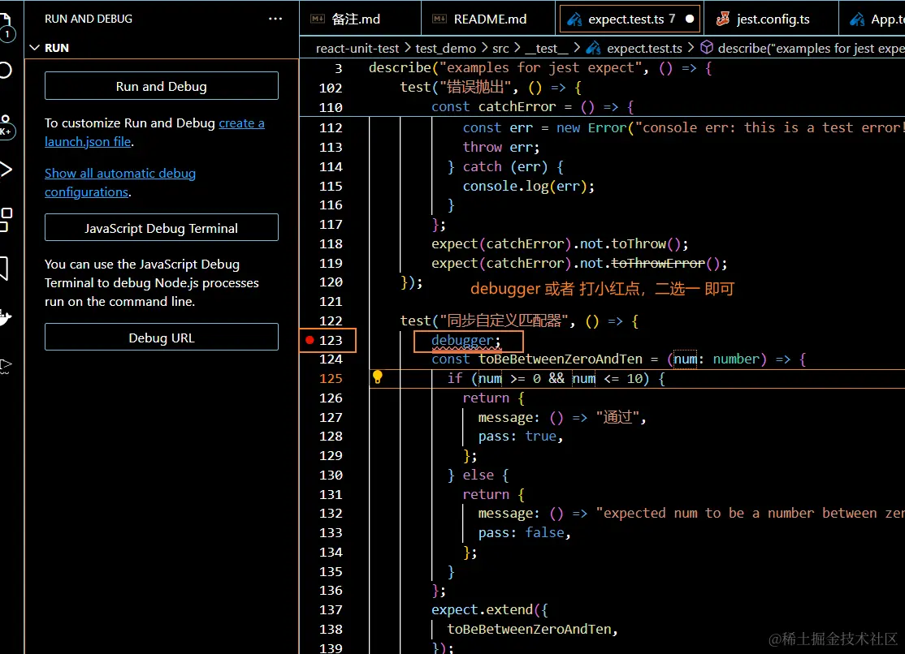

然后通过 vscode JavaScript 调试终端而非普通运行终端，运行对应的单测命令。

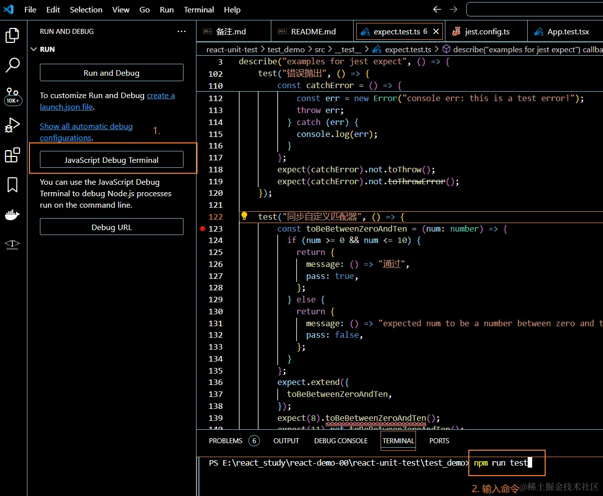

可以看到对应断点处就已经停顿下来了，并且可以在左侧视图层看到当前状态下的变量值，顶部也会有步进等调试的按钮，后面我们就像平时调试代码一样正常调试代码就好了。

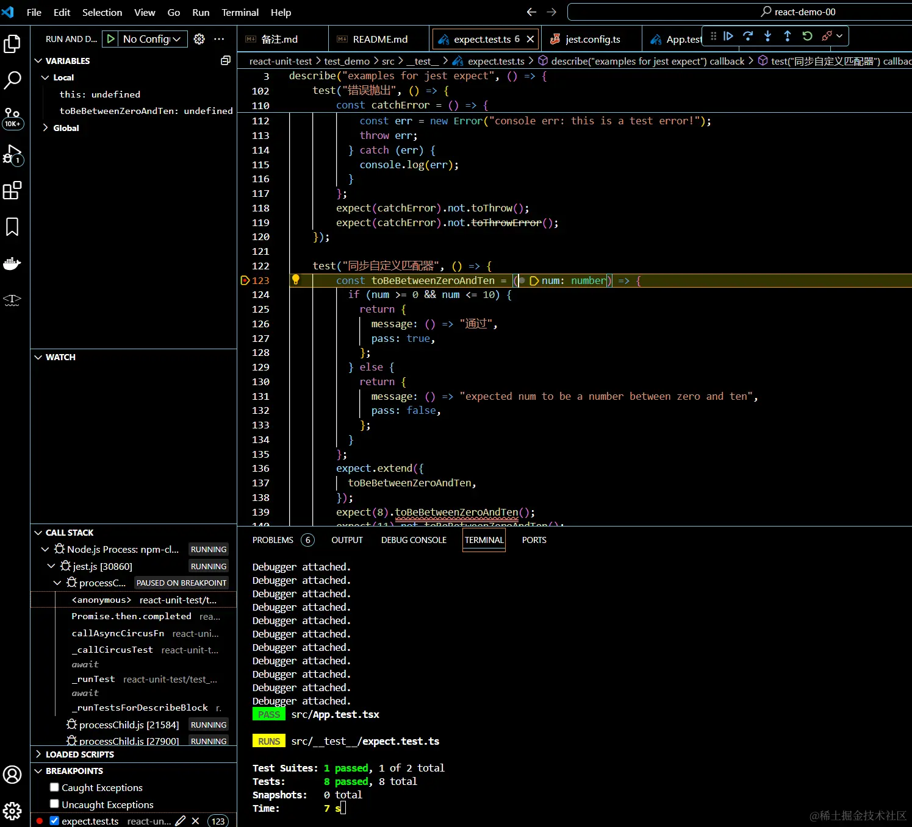
