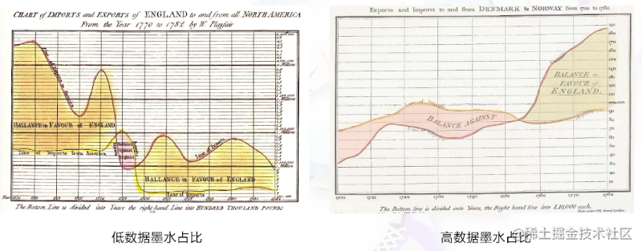
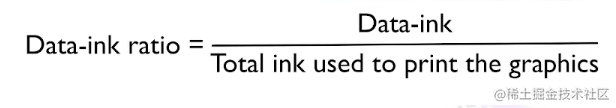
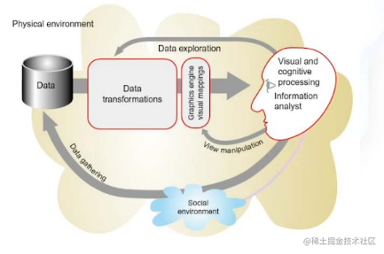
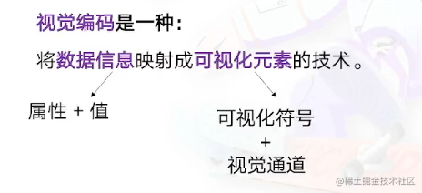
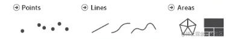
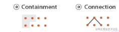
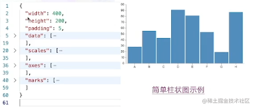
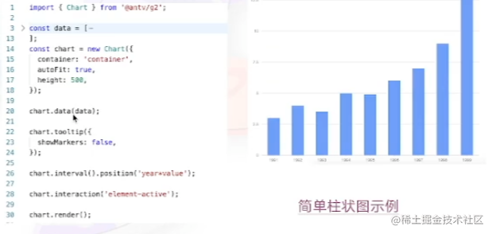
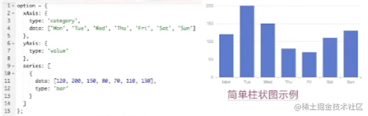

## 什么是数据可视化？

<!--more-->

将数据转化成一种可视化的呈现，

anything that converts data into a visiual representation

(like charts, graphs, maps, sometimes even just tables)

## 展示形式

1. 统计 图表，表格，
2. 地图

## 可视化分类？

1. 科学可视化 （科学领域，医学，化学等等，科学实现数据的直观展示）
2. 信息可视化 （对抽象数据的直观展示， 文本，层次结果，如地图，复杂系统）
3. 可视分析 （对分析结果的直观展示，及交互式反馈，是一个跨领域的方向）

## 为什么要数据可视化？

（让观察者从看见问题到获取到真实）

1. 记录信息
2. 分析推理
3. 证实假设
4. 交流思想

## 可视化设计原则和方法

- 准确地展示数据
- 节省笔墨
- 节省空间
- 消除不必要的“无价值”图形
- 在最短时间内传达最多的信息

能够`正确`的表达数据中的信息而不`产生偏差与歧义`

一个出色的可视化设计可在最短的时间内，使用最少的空间，用最少的笔墨为观众提供最多的信息内涵 --Edward R.Tufte

### Data-link Ratio(最大化数据墨水占比)

- 可视化图形由墨水和空白区域构成
- 数据墨水：可视化图形当中不可擦除的核心部分被称之为“数据墨水”
- 擦除数据墨水将减少图形所传达的信息量
- 数据墨水占比：可视化图形中用于展示核心数据的”墨水“在整体可视化所使用的墨水中的比例

## 常见的错误可视化

1. 透视失真（会发生在3d的可视化中）

- 如果数字是由视觉元素表示的，那么他们应该与视觉元素的感知程度成正比
- 使用清晰，详细和彻底的标签，以避免图形失真和含糊不清

2. 图形设计&数据尺度

图形的每一部分都会产生对其的`视觉预期(visual expectation)`:

- 这些预期往往决定了眼睛实际看到的东西；
- 错误的数据洞察，产生于在图形的某个地方发生的不正确的视觉预期推断。

一个典型的例子：刻度轴，我们期望它从始至终能够保持连贯且一致。

3. 数据上下文

## 视觉感知

可视化致力于外部感知，也就是说，怎样利用大脑以外的资源来增强大脑本身的认知能力。

### 什么是视觉感知？

1. 感知
   - 是指客观事物通过人的感觉器官在人脑中形成的直接反应
2. 感觉器官
   - 眼，耳，鼻，神经末梢
3. 视觉感知
   - 就是客观事物通过人的视觉在人脑中形成的直接反映

### 认知过程

认知心理学将`认知过程`看出由信息的获取，分析，归纳，解码，储存，概念形成，提取和使用等一系列阶段组成的按一定程序进行的信息加工系统。

科学领域中，认知是包含注意力，记忆，产生和理解语言，解决问题，以及进行决策的`心理过程`的组合。

### 相对判断和视觉假象

- 人类视觉系统观察的是变化，而不是绝对值，并且容易被边界吸引。
- 在可视化设计中，设计者需要充分考虑到人类感知系统的这些现象，以使得设计的可视化结果不会存在阻碍或误导用户的可视化元素

### 格式塔学派

- 为什么我们在观看食物的时候会把一部分当做前景，其余部分当做背景？
- 为什么我们能区分形状？
- 什么形状是好的？

- 格式塔学派的理论核心是`整体决定部分的性质，部分依从与整体`。结构比元素重要，视觉形象首先作为统一的整体被认知。感知的事物大于眼睛见到的事物。
- `格式塔理论(Gestalt Laws)`较为系统的对人类如何发现图形元素之间的相关性进行的全面总结，被广泛的应用在了视觉设计当中。

### 就近原则（Proximity）

- 当视觉元素在空间距离上相距较近时，人们通常倾向于将他们归为一组。
- 将数据元素放在靠近的位置，可以突出它们之间的关联性。

### 相似原则（Similarity）

- 形状，大小，颜色，强度等属性方面比较相似时，这些物体就容易被看做一个整体。

### 连续性原则（Continuation）

- 人们在观察事物的时候会很自然的沿着物体的边界，将不连续的物体视为连续的整体。

### 闭合原则（Closure）

- 有些图形可能本身是不完整或者不闭合的，但主体有一种使其闭合的倾向，人民就会很容易的感知整个物体而忽略未闭合的特征。

### 共势原则（Common movement）

- 如果一个对象中的一部分都向共同的方向去运动，那这些共同移动的部分就易被感知为一个整体。

### 对称性原则（Symmetry）

- 对称的元素被视为同一组的一部分。

### 图形与背景关系原则（Figure-ground）

- 大脑通常认为构图中最小的物体是图形，而更大的物则是背景。
- 跟凹面元素相比，凸面元素与图形相关联更多些。

## 视觉编码

对数据进行一个可视化元素的映射，这些映射过程是需要去和我们人类感知的一个基本编码原则，包括对格式塔理论的应用。

法国制图学家[1918-2010]"Semiology of Graphics"[1976] **提出视觉编码的理论原则**。

### 可视化符号（Mark）

用于在可视化当中表现数据元素或元素之间的关联。

- 当表示元素时，Mark包括：点、线、面

- 当表示关系时，Mark包括：闭包，连线

### 视觉通道（Channel）

基于数据属性，控制可视化的符号展现样式，例如，点根据其所代表的数据属性的不同可有不同的形状与颜色。

### 视觉通道有两种类型

- 数量通道（Magnitude Channel）

  用于显示数据的`数值属性`（定量/定序）

  包括：位置，长度，角度，面积，深度，色温，饱和度，曲率。体积。

- 标识通道（Identity Channel）
  用于显示数据的`分类属性`（是什么/在哪里）
  包括：空间区域，色向，动向，形状

### 视觉编码的优先级

不同的视觉编码在表达信息的`作用`和`能力`上有不同的特性

- 当利用`数量通道`编码表示数值属性时：

  位置通道是最为精确的，其次是长度，角度，面积，深度，色相，饱和度，曲率，最后是体积。

- 当利用`标识通道`表示分类属性时：
  划分空间区域最为有效，其后依次是色向，动向，形状。

## 面向前端的可视化工具介绍

### D3

D3.js 是用于数据核实后的开源的JavaScript函数库，被认为是最好的Javascript可视化框架之一。

[简单柱状图示例](https://observablehq.com/@thetylerwolf/day-5-our-first-bar-chart)

### Vega

vega是一种可视化语法。通过其声明式语言，可以用JSON格式描述可视化的视觉外观和交互行为，并使用Canvas或SVG生成视图。

### G2

一套面向常规统计图表，以数据驱动的高交互`可视化图形语法`，具有高度的易用性和扩展性。使用G2，你可以无需关注图表各自繁琐的实现细节，一条语句即可使用Canvas或SVG构建出各种各样的可交换的统计图表

### Echarts

Echarts，一个使用Javascript实现的开源可视化库，可以流畅的运行在PC和移动设备上，兼容当前绝大部分浏览器（IE9/10/11，Chrome，Firefox，Safari等），底层依赖矢量图形库ZRender，提供直观，交互丰富，可高度个性化定制的数据可视化图表

## 其他

数据可视化整体是一个非常完整的流水线，它在前期是包括：数据处理，数据采集，抽取，清洗，存储等等。在最前期是对于数据的操作。再往后，是针对不同业务场景，或者说背景是怎样的，对数据进行一定的组织和抽象，你需要去进行数据的统计和分析它的特征，结合你的背景去梳理出数据如何去表达，它如何去讲诉一个知识，一个故事。再往后呢，才是如何去使用这些数据，进行一个可视化的呈现。

可视化的呈现可以再进行拆分，比方说，我们对于一个数据可视化的呈现的一个工具的话，我们最底层肯定是依赖一个呈现方式的，在web端的话，可能就包括HTML，CSS，我们可以通过HTML，CSS来绘制一个简单的图表，但是如果图表比较复杂的话，用过 HTML，CSS 或者SVG的话，可能绘制的节点会比较的多，对性能会有一些的影响，那么，我们后面就会有，webGL，Canvas，这样子的形式，需要去了解一些跟图形，跟渲染相关的知识。

如果在更上层，对数据如何转换成图形，在这一刻比较感兴趣的话，你可能会需要了解一些关于图形语法，关于数据统计这一块的知识。

如果再往上一层，去完成一些在可视化上面的业务需求，开发需求，那可能需要去了解一下图表库，图形语法库的使用，也可以深入其中的原理去了解一下，

如果再往上一层，想通过数据去讲一个故事，表达你的观点，这方面可以去做个可视化的设计师，去设计可视化的形式，这部分就跟，数据分析，设计，美学，更相关一点。

大家可以根据自己感兴趣的，去进行详细的，针对性的学习。
