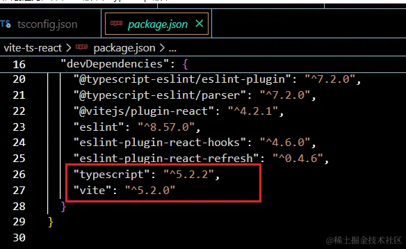
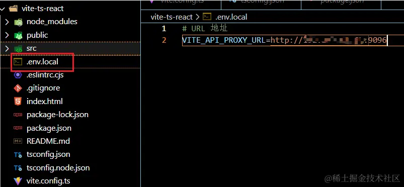
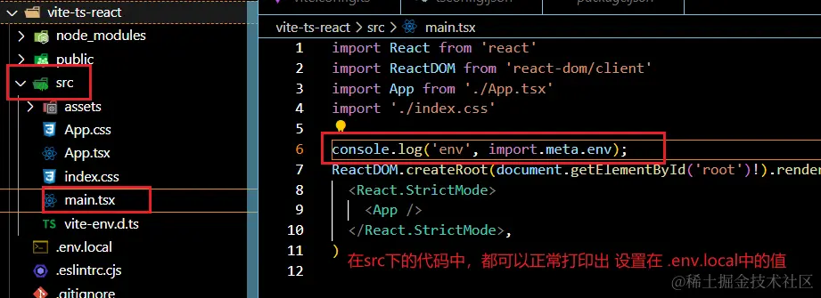
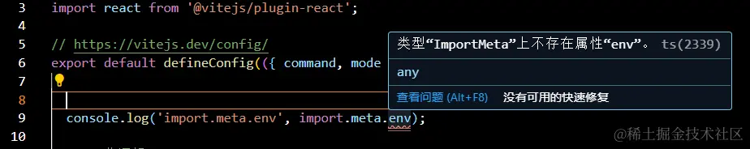
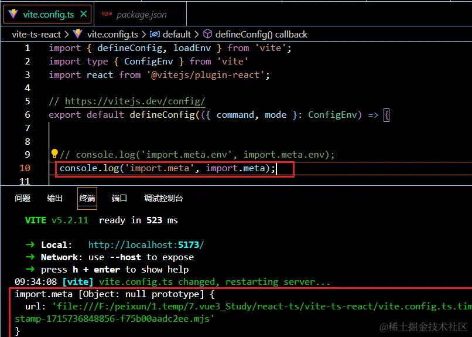
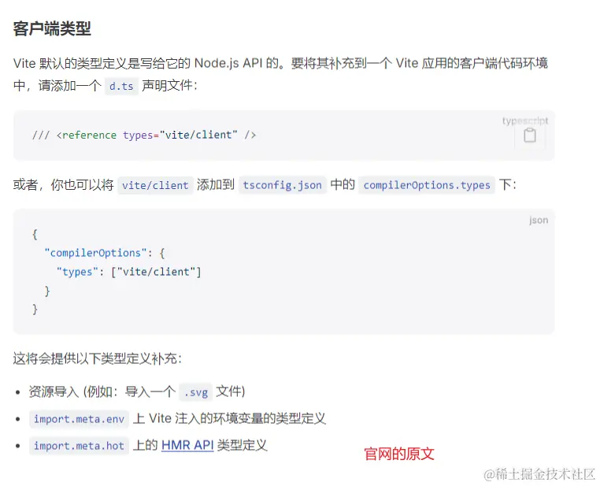
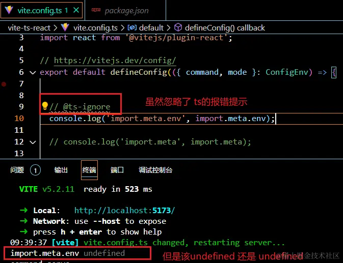
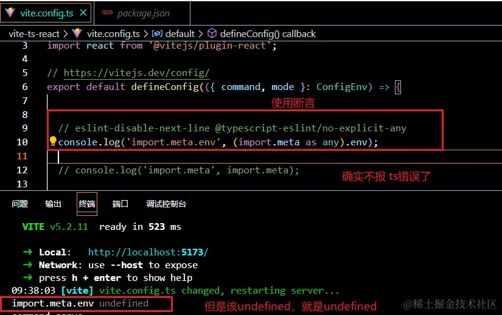
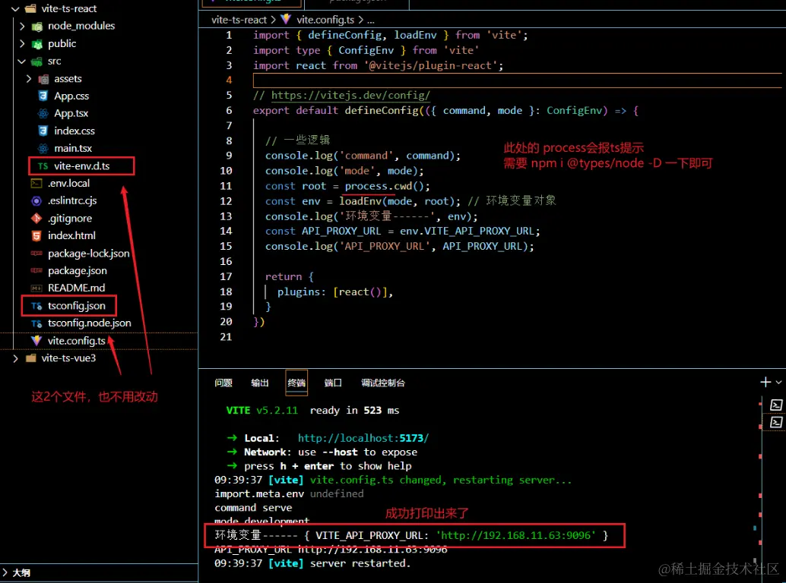

## 前言

记录下踩的坑。。。

这次这个坑，印象很深刻，因为网上找了很多答案，基本都是一样的，试过了，都没有用。。。

我猜，可能人家当时的vite版本和我不一样，人家也没把vite版本给写上去。

## 正文

### 先说环境

使用 vite脚手架命令创建出 vue3 或者 react 的 ts项目

```bash
npm create vite@latest vite-ts-react -- --template react-ts
或
npm create vite@latest vite-ts-vue3 -- --template vue

ps. 
1. 创建项目 node14.18.0(本人当时环境) 能把上面的命令跑完，将项目创建出来，执行 npm install 创建完依赖也没问题
2. 但是执行 npm run dev的时候，会报错，切换成 node18.18.0 能正常跑起来
```

初始化之后的ts项目，vite版本在package.json中显示：

```bash
...
"typescript": "^5.2.2",
"vite": "^5.2.0"
...
```



### 2.开始配置 .env.local

在项目根目录创建.env.local文件



`.env.local`中的值必须要以 【VITE\_】 开头，才能被vite项目识别到

`.env.lcal`文件中的值，在src目录下的任何文件中，都可以在【 `import.meta.env`】中打印出来



但是这个 【`import.meta.env`】唯独在 `vite.config.ts`中 识别不到，而且打印出来还是 `undefined`



直接在【`vite.config.ts`】中 打印 `import.meta`



打印下来，发现 `import.meta`中 根本`没有 env 属性`

网上查到的资料，以及 官网中的资料，让你在 `tsconfig.json` 中加 【`"types": ["vite/client"] `】实际操作下来，实测下来依旧没用,。

也有的让你，在 `vite-env.d.ts` 中添加对 import.meta的env属性的声明，我添加了，依旧没有用。



还有说，用 ts的注释方法 和断言方法





### 查找原因

后来查了下，发现vite 是需要，借助 【loadEnv】才能加载 .env.local 这样的环境文件，因为【localEnv】方法，是在项目`构建时`加载环境变量。

而我们所熟知的【`import.meta.env`】属于是在`运行时`获取环境变量，因此`在 src目录下`，`我们都能读取到`，唯独`在 vite.config.ts`这个配置文件下`读取不到`。



### 最后附上完整 vite.config.ts 代码

```js
import { defineConfig, loadEnv } from 'vite';
import type { ConfigEnv } from 'vite'
import react from '@vitejs/plugin-react';

// https://vitejs.dev/config/
export default defineConfig(({ command, mode }: ConfigEnv) => {
  // 一些自定义的逻辑写在这里
  console.log('command', command);
  console.log('mode', mode);
  const root = process.cwd();
  const env = loadEnv(mode, root); // 环境变量对象
  console.log('环境变量------', env);
  const API_PROXY_URL = env.VITE_API_PROXY_URL;
  console.log('API_PROXY_URL', API_PROXY_URL);


  return {
    plugins: [react()],
    // 其他配置...
  }
});
```
