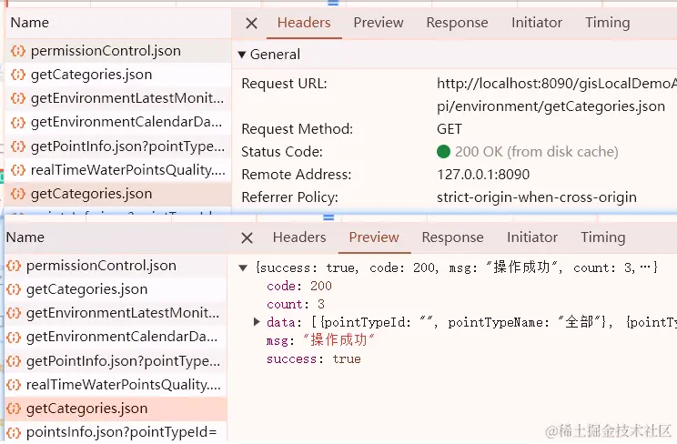
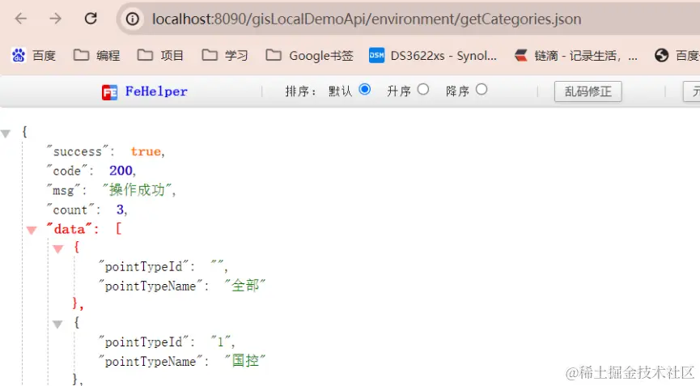
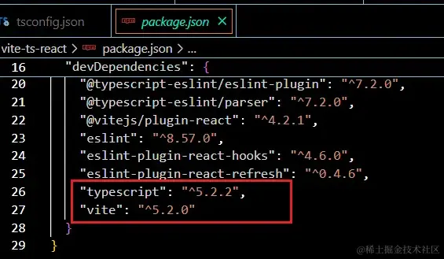
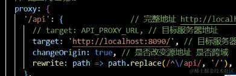
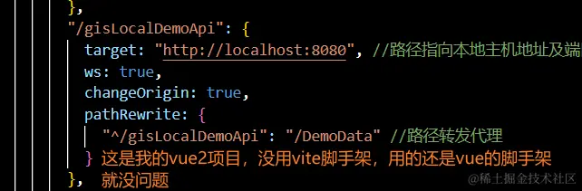
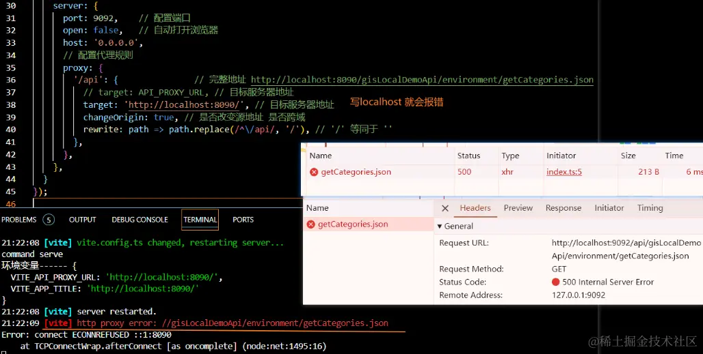
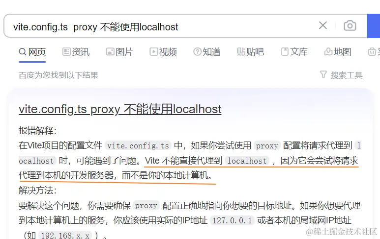
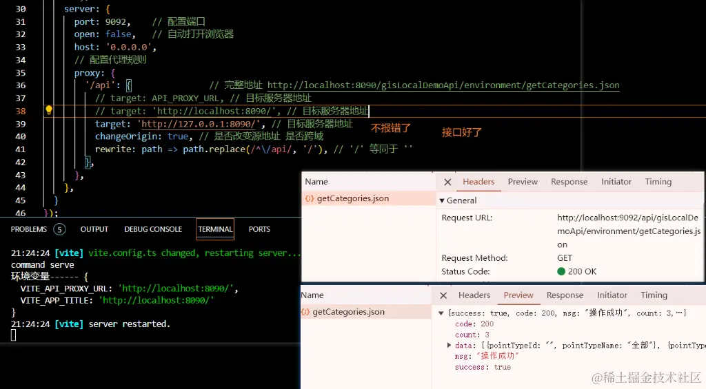

## 前言

也是一个几乎注意不到的坑，之前在vue2的使用，用vue-cli脚手架的时候，压根就不存在这个问题。

但是用了vite之后，好家伙，这也是问题？

## 正文

场景：自己把`vue2项目打包`，`部署在本地的 nginx上`，项目中的`接口数据用的是json文件`代替，如下图



`nginx`上也做了`接口的反向代理`，在浏览器地址栏也可以访问的到`模拟的接口数据`（即json数据）



先说下环境:

```bash
...
"typescript": "^5.2.2",
"vite": "^5.2.0"
...
```



### 案发现场

#### 1. vite的案发现场



大伙看看，这样写，有啥子问题？

提示一下：问题出在 target 这一行

实不相瞒，我`vue2项目` target这里也是这样写的，因为有时候后端接口还没好，但是开发前，已经约定了字段格式，我们就会用json数据，模拟下接口的请求，因为都在本地，所以也在 `vue.config.js` 中这样直接把接口代理到本地的模拟json上面。

#### 2. vue2项目没出过localhost的问题

vite 和 之前的 vue-cli 有些不同



#### 3. vite代理localhost 报500

target这行，在vue-cli的vue2项目上是没有问题的，能正常访问。但是在vite上就问题了，出的还是500的报错。



#### 4.查询原因



## 在vite.config.ts中不能用localhost

最后，我把 `localhost` 改成 `127.0.0.1` ，算是解决了问题


